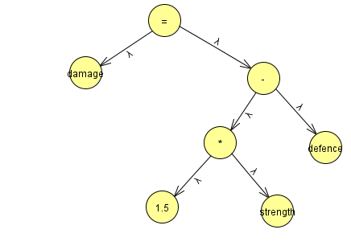
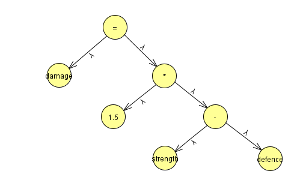

# C++ 进阶知识

## 从源代码到可执行文件

### 一个 C++ 程序究竟是怎么跑起来的

在我们刚开始学习 C++ 的时候，我们运行程序的方法往往是使用 IDE，如 Visual Studio、CLion 等。IDE 会帮助我们完成编译、链接等步骤，最终生成可执行文件。我们只需要点击运行按钮，即可在 IDE 中看到程序的输出。

在本节课程中，我们将学习如何手动编译 C++ 程序，了解编译、链接等步骤的具体内容。

### 过程总览


### 编译工具

针对不同的应用场景和平台，各大厂家设计了不同的C++编译工具

- MSVC（Microsoft Visual C++）：这是微软开发的一款 C++ 开发工具， Visual Studio 中就内置了 MSVC

- GCC（GNU Compiler Collection）：GCC 是由 GNU 开发的一套编译工具，支持多种语言。在本节课程中我们使用的编译工具就是 GCC（针对 C 的前端程序为 gcc，针对 C++ 的前端程序为 g++）

在本节课程中，我们使用 wsl 作为运行环境，当然，Windows 的环境也是可以的，你可以通过一下的代码完成 gcc 的安装

Linux：
~~~bash
sudo apt update
sudo apt install build-essential
~~~

Windows:
~~~bash
//请以管理员身份运行 powershell
Set-ExecutionPolicy RemoteSigned -scope CurrentUser
irm get.scoop.sh | iex

scoop bucket add main
scoop bucket add extras

scoop install gcc
~~~

当然，在 Windows 环境中你也可以直接到 [mingw](https://www.mingw-w64.org/downloads/) 的官网进行下载，并将 bin 目录添加到环境变量中。

### 预处理(Preprocessing)

```bash
g++ -E main.cpp -o main.i
```
作用：

- 处理 #include, #define, #ifdef 等预处理命令。
- 替换宏，展开头文件。

输出：.i 文件（纯C++代码，无预处理指令）

示例：../example/simplestCase

### 编译(Compiling)

~~~bash
g++ -S main.i -o main.s
~~~

这一步是编译原理课的重要内容，在这里只进行一些简单的介绍。，

编译的五大步骤：

- 词法分析
- 语法分析
- 语义分析与中间代码生成
- 优化
- 目标代码生成

#### 词法分析

在这一步中，词法分析器（Lexer）读取源代码，将其分解为一系列的标记（token）或词法分析单元（lexeme）。这些是编程语言中的基本元素，如关键字，标识符，字面量等。

~~~
int a = 3 + 5; -> [int] [a] [=] [3] [+] [5] [;]
~~~

#### 语法分析

语法分析器使用由词法分析器生成的各个词法单元来创建树形的中间表示。该中间表示给出了词法分析产生的词法单元流的语法结构。一个比较常见的表示方法是语法树(syntax tree)，树中的每一个内部节点表示一个运算，而子节点表示该运算的分量。

对于下面的代码：

~~~C++
damage=1.5*strength-defence
~~~

一颗比较符合直觉的语法分析树长成这样：



但是也有可能长成这样：



这就是在编译中遇到的二义性问题。

对于另外一组代码：

~~~C++
if(a>1)
    if(a==2)
        std::cout<<"something1";
    else
        std::cout<<"something2";
~~~

同样地，编译器也并不知道 else 应该和哪个 if 配对。

为了解决二义性的问题，我们引入上下文无关文法这个概念，并通过合理地设计这个文法，消除由算符优先级和 if-else 悬挂所引起的文法二义性。

##### 上下文无关文法：

一个上下文无关文法是一个四元组，$ G= \{V,\sum,R,S\} $，其中 $V$ 是非终止符的集合， $\sum$ 是终止符的集合，$R$ 是产生式规则的集合，$S$ 是开始符号。

一个简单的例子：
$V=\{E\}$
$\sum=\{a,b\}$
$S \to E, E \to aEb | \epsilon$

消除由运算符优先级引起的文法二义性
~~~
<expr>   ::= <expr> "+" <term>
          | <expr> "-" <term>
          | <term>

<term>   ::= <term> "*" <factor>
          | <term> "/" <factor>
          | <factor>

<factor> ::= "(" <expr> ")"
          | number
          | identifier
~~~

消除由 if-else 悬挂引起的文法二义性

~~~
<stmt>           ::= <matched_stmt> | <unmatched_stmt>

<matched_stmt>   ::= "if" "(" <expr> ")" <matched_stmt> "else" <matched_stmt>
                  | <other_stmt>

<unmatched_stmt> ::= "if" "(" <expr> ")" <stmt>
                  | "if" "(" <expr> ")" <matched_stmt> "else" <unmatched_stmt>
~~~


### 汇编

~~~bash
g++ -c main.s -o main.o
~~~

汇编这一步将编译器生成的中间代码（汇编代码）翻译为机器码（一种包含机器指令的二进制格式文件），但尚未完成链接。

.o 生成的文件不是人类可读的，但是如果你实在是好奇里面究竟有什么，可以在终端输入如下的指令：

~~~bash
objdump -d test.o
~~~

它会把机器码进行反汇编，输出的格式应该类似于：


~~~
test.o:     file format pe-x86-64


Disassembly of section .text:

0000000000000000 <main>:
   0:   55                      push   %rbp
   1:   48 89 e5                mov    %rsp,%rbp
   4:   48 83 ec 30             sub    $0x30,%rsp
   8:   e8 00 00 00 00          call   d <main+0xd>
   d:   c7 45 fc 01 00 00 00    movl   $0x1,-0x4(%rbp)
  14:   83 7d fc 01             cmpl   $0x1,-0x4(%rbp)
  18:   75 16                   jne    30 <main+0x30>
  1a:   48 8d 15 00 00 00 00    lea    0x0(%rip),%rdx        # 21 <main+0x21>
  21:   48 8b 05 00 00 00 00    mov    0x0(%rip),%rax        # 28 <main+0x28>
  28:   48 89 c1                mov    %rax,%rcx
  2b:   e8 00 00 00 00          call   30 <main+0x30>
  30:   83 7d fc 02             cmpl   $0x2,-0x4(%rbp)
  34:   75 18                   jne    4e <main+0x4e>
  36:   48 8d 15 0b 00 00 00    lea    0xb(%rip),%rdx        # 48 <main+0x48>
  3d:   48 8b 05 00 00 00 00    mov    0x0(%rip),%rax        # 44 <main+0x44>
  44:   48 89 c1                mov    %rax,%rcx
  47:   e8 00 00 00 00          call   4c <main+0x4c>
  4c:   eb 16                   jmp    64 <main+0x64>
  4e:   48 8d 15 16 00 00 00    lea    0x16(%rip),%rdx        # 6b <main+0x6b>
  55:   48 8b 05 00 00 00 00    mov    0x0(%rip),%rax        # 5c <main+0x5c>
  5c:   48 89 c1                mov    %rax,%rcx
  5f:   e8 00 00 00 00          call   64 <main+0x64>
  64:   b8 00 00 00 00          mov    $0x0,%eax
  69:   48 83 c4 30             add    $0x30,%rsp
  6d:   5d                      pop    %rbp
  6e:   c3                      ret
  6f:   90                      nop
~~~


### 链接

~~~bash
g++ main.o foo.o -o program
~~~

链接将多个目标文件和库组织成一个完整的可执行文件或共享库。

#### 静态链接

~~~bash
g++ main.o foo.o -o program
~~~

所有的代码在链接阶段合并成一个单独的大文件，运行的时候无需依赖外部文件库。

- 优点：部署简单，运行稳定
- 缺点：文件体积大，重复冗余，不利于更新

#### 动态链接

~~~bash
g++ main.o -o program -lfoo
~~~

最终生成的可执行文件中包含对动态库的引用，例如 windows 中的 .dll 和 Linux 中的 .so

- 优点：节省空间，多个程序可以共享库，易于更新

- 缺点：运行的时候需要依赖外部库，存在 [依赖地狱](https://zh.wikipedia.org/wiki/%E7%9B%B8%E4%BE%9D%E6%80%A7%E5%9C%B0%E7%8B%B1)


#### 静态库
代码被复制到最终的可执行文件中

~~~bash
g++ -c math.cpp        # 编译成目标文件 math.o
ar rcs libmath.a math.o  # 打包成静态库
g++ main.cpp -L. -lmath -o main  # 链接静态库
~~~
rcs：这是一组参数，r代表 将 math.o 加入库中，c代表创建库文件，s代表生成符号索引。
-L. 表示在当前目录下寻找库文件
-lxxx 表示链接 libxxx.a


#### 动态库
可执行文件运行时加载库文件

~~~bash
g++ -fPIC -shared math.cpp -o libmath.so  # 创建动态库
g++ main.cpp -L. -lmath -o main           # 链接动态库（运行时需要 libmath.so）
~~~

### 管理大型项目的构建：Makefile 与 Cmake